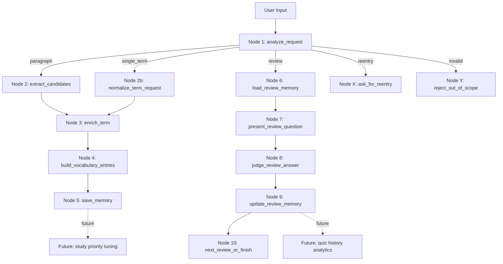

# Challenge 12

## LeXi v2

`LeXi`는 `Lexicon`에서 이름을 가져온 영어 기술 문서 학습 에이전트다.  
이번 단계에서는 기존의 단순 단어 추출 MVP를 업그레이드해, 입력 유형을 판단하고, 조건 분기하며, 도구와 메모리를 사용해 학습 흐름을 운영하는 `Gemini + LangGraph` 기반 학습 에이전트로 확장한다.

핵심 목표는 단순히 단어를 뽑는 것이 아니라, 사용자의 입력 의도에 따라 다른 학습 경로로 라우팅하고, 각 단어를 근거와 함께 정리하며, 저장된 단어장을 기반으로 반복 복습까지 가능하게 만드는 것이다.

실제 구현은 [`main.ipynb`](/Users/jaeyoung/Developments/study/agents/ai-agent-tutorial/challenge/12/main.ipynb)에 담고, 이 문서는 그 설계 의도를 정리한다.

## Step 1. Agent Design

### Theme

- `Education & Learning`

### Agent Name

- `LeXi v2`

### Primary User

- 영어 기술 문서를 읽는 한국인 개발자

### Purpose

- 영어 기술 문서를 읽을 때 학습 가치가 높은 단어를 자동으로 추린다.
- 단어 하나 또는 짧은 기술 표현을 바로 학습 카드로 확장할 수 있다.
- 저장된 단어장을 기반으로 상호작용형 복습을 진행한다.
- 각 단어를 문맥과 근거 문장, 학습 메모와 함께 정리한다.

### Problem It Solves

- 기술 문서를 읽으며 중요한 단어를 수동으로 골라야 하는 번거로움
- 같은 단어라도 기술 문맥에 따라 뜻이 달라 사전 뜻만으로는 이해하기 어려운 문제
- 입력이 문단인지, 단어 하나인지, 복습 요청인지에 따라 다른 학습 흐름이 필요한 문제
- 단어를 정리한 뒤에도 나중에 복습하고 누적 학습 기록을 관리하기 어려운 문제

### Key Features

- Gemini가 입력 의도를 분류해 적절한 학습 경로로 라우팅
- Gemini가 학습 가치가 높은 단어 후보를 추출
- Custom Tool이 원문에서 단어가 나온 문장을 찾아 근거를 보강
- Custom Tool이 복습 후보를 균형 있게 선택
- LangGraph가 조건 분기와 병렬 처리 흐름을 관리
- SQLite 기반 메모리에 학습 결과와 복습 이력을 저장
- 사용자가 뜻을 입력하면 hybrid 방식으로 정답 여부를 판정

## Step 2. Workflow Design

### High-Level Workflow

아래 Mermaid 다이어그램에서 실선은 이번 과제에서 구현하는 흐름이고, 점선은 향후 확장 흐름이다.



### Routing Strategy

`analyze_request`는 입력을 다음 다섯 가지 중 하나로 분류한다.

- `paragraph`
  - 영어 기술 문장 또는 문단 입력
- `single_term`
  - 단어 하나 또는 짧은 기술 표현 입력
- `review`
  - 사용자가 명시적으로 복습을 요청한 경우
  - 예: `review`, `quiz`, `복습`, `퀴즈`, `다시 보기`
- `reentry`
  - 빈 입력 또는 2000자를 초과한 입력처럼 다시 입력을 받아야 하는 경우
- `invalid`
  - 영어 기술 문서 학습과 무관한 질문
  - 일반 한글 질문 또는 일반 잡담

이 분류 결과를 바탕으로 LangGraph의 Conditional Edge가 서로 다른 경로로 라우팅한다.

## Step 3. Foundation Building

### Why This Structure

- 이번 과제의 핵심은 단순 선형 흐름이 아니라 `입력 분석 -> 조건 분기 -> 단어별 보강 -> 결과 생성 -> 저장 -> 복습`이다.
- 따라서 기존의 2-node 선형 그래프보다, 역할이 분리된 다중 노드 구조가 더 적합하다.
- 상태는 `MessagesState` 대신 작은 `custom state`를 사용하되, 복습 흐름까지 포함할 수 있게 확장한다.
- 각 함수는 복잡한 규칙 계산보다 `프롬프트 준비 -> Gemini 호출 또는 Tool 호출 -> 상태 업데이트`에 집중한다.

### State Design

```python
class VocabularyEntry(TypedDict):
    word: str
    lemma: str
    meaning_in_context: str
    source_sentence: str
    context_note: str
    why_it_matters: str
    study_priority: str

class MemoryRecord(TypedDict):
    word: str
    lemma: str
    meaning_in_context: str
    source_sentence: str
    context_note: str
    created_at: str
    review_count: int
    last_reviewed_at: str | None
    last_review_result: str | None

class TermEvidence(TypedDict):
    term: str
    source_sentences: list[str]

class ReviewState(TypedDict):
    current_word: str
    current_source_sentence: str
    expected_meaning: str
    user_answer: str
    judgment: str
    explanation: str

class LearningState(TypedDict):
    input_text: str
    route: str
    candidate_words: list[str]
    terms_to_study: list[str]
    term_evidence: dict[str, TermEvidence]
    vocabulary_entries: list[VocabularyEntry]
    review_state: ReviewState | None
    review_history: list[dict[str, str]]
```

각 타입의 역할은 다음과 같다.

- `VocabularyEntry`
  - 사용자에게 보여주는 최종 학습 카드
- `MemoryRecord`
  - SQLite에 저장되는 영속 학습 기록
- `TermEvidence`
  - tool로 찾은 근거 문장
- `ReviewState`
  - 현재 복습 문제와 사용자 답변 상태
- `LearningState`
  - LangGraph 노드 간에 공유되는 런타임 상태

## Step 4. Node Design

### 1. `analyze_request`

- 입력 텍스트를 읽는다.
- Gemini 또는 간단한 규칙과 함께 입력 유형을 분류한다.
- 결과를 `route`에 저장한다.

### 2. `extract_candidates`

- `route == "paragraph"`일 때 실행한다.
- Gemini에게 학습 가치가 높은 단어를 최대 5개 고르게 한다.
- 결과를 `candidate_words`와 `terms_to_study`에 저장한다.

### 3. `normalize_term_request`

- `route == "single_term"`일 때 실행한다.
- 짧은 단어 또는 표현 입력을 학습 대상으로 정규화한다.
- 결과를 `terms_to_study`에 저장한다.

### 4. `enrich_term`

- `terms_to_study`의 각 단어를 개별적으로 처리한다.
- `locate_source_sentences` tool을 사용해 원문에서 관련 문장을 찾는다.
- 결과를 `term_evidence`에 누적한다.
- 이 단계는 병렬 처리 대상으로 설계한다.

### 5. `build_vocabulary_entries`

- `terms_to_study`와 `term_evidence`를 읽는다.
- Gemini에게 각 단어의 문맥 기반 뜻과 설명을 구조화하게 한다.
- 결과를 `vocabulary_entries`에 저장한다.

### 6. `save_memory`

- 새로 생성된 `vocabulary_entries`를 SQLite 메모리에 저장한다.
- 기존 단어가 있으면 중복 저장 대신 갱신 정책을 적용한다.

### 7. `load_review_memory`

- `route == "review"`일 때 실행한다.
- SQLite 메모리에서 복습 가능한 단어를 불러온다.
- `select_review_candidates` tool을 사용해 이번 세션의 출제 대상을 고른다.

### 8. `present_review_question`

- 선택된 단어와 그 단어가 실제로 쓰였던 문장을 보여준다.
- 사용자에게 한국어 뜻 입력을 요청한다.

### 9. `judge_review_answer`

- 사용자가 입력한 한국어 뜻을 hybrid 방식으로 판정한다.
- 정확하면 success, 애매하면 LLM semantic judge를 사용한다.

### 10. `update_review_memory`

- `review_count`, `last_reviewed_at`, `last_review_result`를 SQLite에 반영한다.
- 틀렸다면 정답 뜻과 짧은 설명을 준비한다.

### 11. `next_review_or_finish`

- 한 세션 기본 3개 단어를 출제하고 종료한다.
- 단어를 맞췄을 때마다 `계속할까요?`를 물어 추가 review 여부를 판단한다.

### 12. `ask_for_reentry`

- 빈 입력, 2000자 초과 입력 등 다시 입력을 받아야 하는 경우 안내 문구를 반환한다.

### 13. `reject_out_of_scope`

- 영어 기술 문서 학습과 무관한 질문을 거절한다.
- 일반 한글 질문이나 일반 잡담도 이 경로에서 처리한다.

## Step 5. Conditional Edge

이번 과제에서 반드시 하나 이상의 Conditional Edge를 구현한다.

기본 연결은 아래처럼 유지한다.

```text
START -> analyze_request

analyze_request
  - paragraph -> extract_candidates -> enrich_term -> build_vocabulary_entries -> save_memory -> END
  - single_term -> normalize_term_request -> enrich_term -> build_vocabulary_entries -> save_memory -> END
  - review -> load_review_memory -> present_review_question -> judge_review_answer -> update_review_memory -> next_review_or_finish -> END
  - reentry -> ask_for_reentry -> END
  - invalid -> reject_out_of_scope -> END
```

## Step 6. Tool Integration

이번 구현에서는 최소 1개의 Tool을 반드시 통합해야 하지만, LeXi v2는 아래 두 개를 기본 도구로 채택한다.

### 1. `locate_source_sentences`

- 입력:
  - `term`
  - `input_text`
- 역할:
  - 입력 텍스트 안에서 해당 단어 또는 표현이 포함된 문장을 찾는다.
- 출력:
  - 관련 원문 문장 리스트
- 장점:
  - 문맥 기반 학습이라는 LeXi의 목적과 가장 직접적으로 연결된다.
  - 모델이 문장을 임의로 재구성하지 않고 원문 근거를 보여줄 수 있다.

### 2. `select_review_candidates`

- 입력:
  - SQLite에 저장된 memory records
  - 세션당 출제할 문제 수
- 역할:
  - 이번 review 세션에 사용할 단어를 고른다.
- 선택 기준:
  - `review_count`가 적은 단어 우선
  - `last_reviewed_at`이 오래된 단어 우선
  - `last_review_result == "wrong"`인 단어 가중치 추가
  - 직전에 낸 단어는 제외
- 장점:
  - 특정 단어만 반복되지 않게 하고, 여러 단어가 골고루 복습되게 만든다.

이번 단계에서는 로컬 glossary 자료가 없으므로 `search_local_glossary`는 제외한다.

## Step 7. Parallel Execution

Optional requirement를 반영하기 위해 `enrich_term` 단계는 병렬 처리 가능하도록 설계한다.

- `terms_to_study`의 각 단어에 대해 `Send API`로 병렬 worker를 실행
- 각 worker는 하나의 term만 담당
- 각 결과를 `term_evidence`에 병합
- 이후 `build_vocabulary_entries`가 병합된 결과를 읽어 최종 엔트리를 만든다

이 구조는 단어 수가 많아질수록 체감 성능 개선에 유리하다.

## Step 8. Memory Design

이번 단계에서 memory는 선택 기능이 아니라 LeXi v2의 핵심 설계다.

### Storage Strategy

- 저장 위치:
  - `challenge/12/lexi_memory.db`
- 저장 방식:
  - 로컬 SQLite

### Memory Record Fields

- `word`
- `lemma`
- `meaning_in_context`
- `source_sentence`
- `context_note`
- `created_at`
- `review_count`
- `last_reviewed_at`
- `last_review_result`

### Why Memory Is Core

- review는 memory가 있어야만 동작한다.
- 이전에 학습한 단어를 다시 불러와 반복 학습할 수 있다.
- review_count와 최근 결과를 바탕으로 균형 잡힌 복습이 가능해진다.

## Step 9. Review Design

LeXi v2의 review는 단순 결과 요약이 아니라 상호작용형 흐름이다.

### Review Session Rules

- review는 사용자가 명시적으로 요청할 때만 시작한다.
- 한 세션의 기본 출제 수는 3개다.
- 각 문제는 다음 순서로 진행한다.
  - 영어 단어 제시
  - 해당 단어가 실제로 쓰였던 문장 제시
  - 사용자가 한국어 뜻 입력
  - 정답 여부 판정
  - 맞으면 `계속할까요?` 질문
  - 틀리면 정답 뜻과 짧은 설명 제공 후 다음 단어 진행

### Answer Judging

- 1차:
  - 정규화 기반 비교
- 2차:
  - 애매한 경우 Gemini semantic judge

즉 정답 판정은 `hybrid` 방식으로 진행한다.

## Step 10. Input Policy And Failure Handling

### Input Policy

- 입력 길이는 최대 2000자다.
- 2000자를 초과하면 실패 처리하지 않고, 길어서 처리할 수 없다고 안내한 뒤 재입력을 요청한다.
- `review`는 명시 요청일 때만 진입한다.
- review 정답 입력은 한국어 뜻만 받는다.

### Failure Handling

아래 경우는 `invalid` 또는 failure 경로로 처리한다.

- 영어 기술 문서 학습과 무관한 질문
- 일반 한글 질문
- 일반 잡담 또는 상식 질문
- review 요청인데 memory가 비어 있는 경우

아래 경우는 `reentry` 경로로 처리한다.

- 빈 입력
- 2000자 초과 입력

## Implementation Scope

### 이번 단계에서 구현하는 것

- `Gemini + LangGraph` 기반 최소 3개 이상의 node
- 최소 1개의 Conditional Edge
- 최소 1개의 Tool 통합
- `custom state` 기반 다중 노드 파이프라인
- SQLite 기반 memory 저장
- 상호작용형 review 흐름
- notebook 안에서 설계 문서와 구현을 함께 제시
- 필요 시 `Send API` 기반 병렬 처리까지 확장

### 이번 단계에서 구현하지 않는 것

- 로컬 glossary 데이터베이스 구축
- 웹 UI
- 고급 학습 통계
- 난이도 기반 개인화 추천
- 장기 복습 스케줄링

## Notebook Plan

구현 노트북은 [`main.ipynb`](/Users/jaeyoung/Developments/study/agents/ai-agent-tutorial/challenge/12/main.ipynb)에 작성하며, 셀 구성은 아래 순서를 따른다.

1. LeXi v2 소개와 Mermaid workflow
2. `load_dotenv`, `init_chat_model`, LangGraph import
3. 상태 타입과 structured output 타입 정의
4. `analyze_request` 구현
5. `extract_candidates` 구현
6. `normalize_term_request` 구현
7. `locate_source_sentences` tool 구현
8. `select_review_candidates` tool 구현
9. `enrich_term` 구현
10. `build_vocabulary_entries` 구현
11. SQLite memory helper 구현
12. `save_memory` 구현
13. review 관련 node 구현
14. Conditional Edge 연결
15. 필요 시 `Send API` 병렬 처리 연결
16. 샘플 입력 실행
17. 결과 확인 및 향후 확장 정리

## Dependencies And Run Notes

- `langgraph`
- `langchain`
- `langchain-google-genai`
- `pydantic`
- `python-dotenv`
- `sqlite3` (Python standard library)

실행 전 `.env`에 `GOOGLE_API_KEY`가 있어야 한다.  
모델명은 기본적으로 `gemini-3-flash-preview`를 사용하고, 필요하면 `GOOGLE_GENAI_MODEL` 환경변수로 바꿀 수 있다.

예시:

```bash
uv sync
uv run jupyter notebook
```

## Test Plan

- `analyze_request`가 입력을 올바르게 분류하는지 확인
- `paragraph` 입력 시 `candidate_words`가 비어 있지 않은지 확인
- `single_term` 입력 시 `terms_to_study`가 1개 이상 생성되는지 확인
- `locate_source_sentences`가 실제로 원문에서 source sentence를 찾는지 확인
- `build_vocabulary_entries` 실행 후 `vocabulary_entries`가 생성되는지 확인
- `save_memory`가 SQLite에 학습 결과를 저장하는지 확인
- `review` 요청 시 memory에서 단어를 읽어오는지 확인
- `select_review_candidates`가 특정 단어에 쏠리지 않고 균형 있게 단어를 고르는지 확인
- 사용자의 한국어 답변을 hybrid 방식으로 판정하는지 확인
- 정답이면 `계속할까요?` 흐름으로 가는지 확인
- 오답이면 정답 뜻과 짧은 설명을 보여주고 다음 단어로 넘어가는지 확인
- Conditional Edge가 `paragraph`, `single_term`, `review`, `reentry`, `invalid`를 다른 경로로 보내는지 확인
- 병렬 처리 적용 시 각 term worker 결과가 정상 병합되는지 확인
- 2000자 초과 입력 시 재입력 요청이 나오는지 확인
- 영어 기술 문서와 무관한 질문이 실패 처리되는지 확인

## Completion Criteria

이번 과제의 완료 기준은 아래와 같다.

- LangGraph를 사용한다.
- 최소 3개의 functioning node를 구현한다.
- 최소 1개의 Conditional Edge를 구현한다.
- 최소 1개의 Tool을 통합한다.
- 설계 문서와 코드를 Jupyter Notebook에 함께 포함한다.
- 입력 유형에 따라 다른 학습 경로로 분기할 수 있다.
- 구조화된 단어장 결과를 생성할 수 있다.
- SQLite memory에 학습 결과를 저장할 수 있다.
- review 흐름에서 사용자 답변을 판정하고 memory를 갱신할 수 있다.
