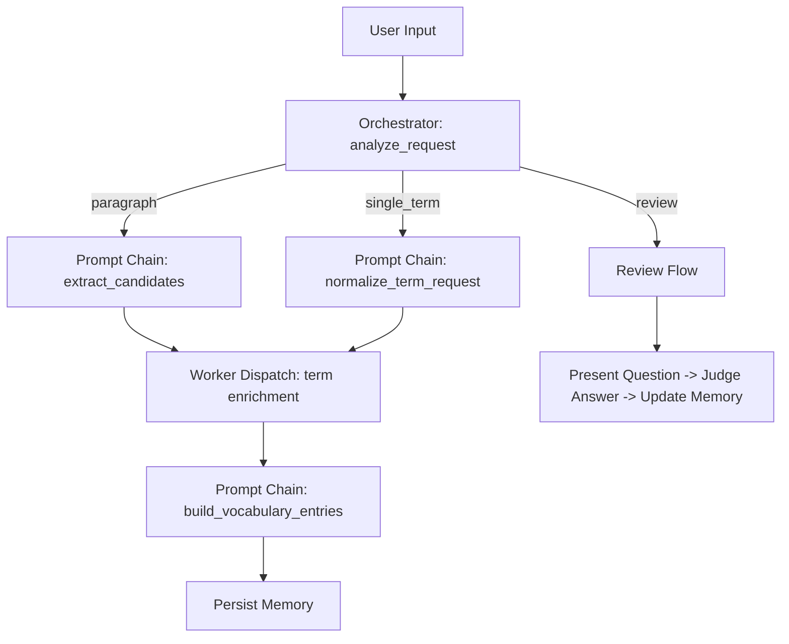

# Challenge 13

## LeXi

`LeXi`는 [`challenge/12/main.ipynb`](/Users/jaeyoung/Developments/study/ai-agent-tutorial/challenge/12/main.ipynb)에 구현된 LeXi v2를 Python application으로 재구성한 영어 기술 문서 학습 에이전트다. 이번 단계에서는 notebook 대신 `Streamlit` 기반 채팅 UI를 사용해, 학습 입력부터 단어 카드 생성과 복습까지 한 화면에서 끝까지 사용할 수 있게 만든다.

사용자는 하나의 채팅 입력창으로 아래 작업을 모두 수행할 수 있다.

- 영어 기술 문단 입력
- 영어 기술 용어 입력
- `review` 요청
- 복습 답안 입력

### 에이전트 이름

- `LeXi`

### 한 줄 소개

- 영어 기술 문장이나 용어를 입력하면, 학습할 만한 핵심 표현을 문맥 기반 뜻과 근거 문장으로 정리하고, 저장된 단어를 다시 복습하게 도와주는 학습 에이전트

### 핵심 기능 3가지

- `입력 유형 자동 분기`
  - 문단 학습, 단일 용어 학습, 복습 요청을 구분해 다른 워크플로로 처리한다.
  - 사용자가 입력 형식을 엄격히 맞추지 않아도 바로 학습 흐름으로 들어갈 수 있게 하기 위해 추가했다.
- `문맥 기반 단어 카드 생성`
  - 중요한 기술 용어를 추출하고, 한국어 뜻, 출처 문장, 맥락 설명, 학습 우선순위를 함께 정리한다.
  - 단순 번역이 아니라 실제 기술 문서를 읽을 때 도움이 되는 학습 카드가 필요해서 추가했다.
- `저장 기반 복습`
  - SQLite에 저장된 단어장을 기반으로 review 문제를 내고 답안을 판정한다.
  - 한 번 추출하고 끝나는 것이 아니라 반복 학습까지 이어지게 하기 위해 추가했다.

### 예상 사용 시나리오

```text
사용자: Caching reduces latency, but inconsistent invalidation can cause stale data.
LeXi: 이 입력에서 학습 가치가 높은 표현을 정리했어요.

1. latency
- 뜻: 지연 시간
- 문장: Caching reduces latency, but inconsistent invalidation can cause stale data.
- 설명: 성능을 말할 때 응답이 늦어지는 시간을 뜻합니다.

2. invalidation
- 뜻: 무효화
- 문장: Caching reduces latency, but inconsistent invalidation can cause stale data.
- 설명: 캐시 데이터를 더 이상 유효하지 않게 처리하는 동작을 뜻합니다.

사용자: review
LeXi: 단어: latency
문장: Caching reduces latency, but inconsistent invalidation can cause stale data.
이 문맥에서 뜻을 한국어로 입력해 주세요.
```

## Advanced Pattern

`LeXi`는 `Workflow Architecture`를 사용한다. 이번 과제에서 대표로 선택한 패턴은 `Orchestrator-Workers`다.

- 중앙 orchestrator가 입력을 분석하고 학습 경로를 결정한다.
- term별 근거 문장 수집은 worker에게 위임한다.
- 이 과정에서 여러 LLM 호출이 순차적으로 이어지는 `Prompt Chaining`과, term별 처리 작업을 병렬로 나누는 `Parallelization`도 함께 사용한다.



## App Behavior

- `st.chat_input`과 `st.chat_message` 기반의 단일 채팅 UI를 사용한다.
- 학습 결과는 카드형 assistant 메시지로 렌더링한다.
- review 요청 시 현재 단어와 예문을 보여 주고, 다음 사용자 입력을 답안으로 이어받는다.
- sidebar에서 저장된 memory 개수, review 활성 상태, 남은 queue 길이를 확인할 수 있다.
- `Reset Session`은 채팅 세션만 초기화하고 SQLite memory는 유지한다.

## Run

```bash
uv run streamlit run challenge/13/run.py
```

## Environment

- required: `GOOGLE_API_KEY`
- optional: `GOOGLE_GENAI_MODEL`

## Project Structure

```text
challenge/13/
  README.md
  run.py
  lexi_app/
    app.py
    config.py
    state.py
    schemas.py
    tools.py
    memory.py
    nodes.py
    graph.py
    service.py
```

## Implementation Notes

- 실행 진입점은 [`challenge/13/run.py`](/Users/jaeyoung/Developments/study/ai-agent-tutorial/challenge/13/run.py)다.
- 앱 패키지는 `challenge/13/lexi_app/` 아래에 둔다.
- SQLite memory는 `challenge/13/lexi_memory.db`를 사용해 12번 실험 데이터와 분리한다.
- 목표는 12번 notebook의 학습/복습 흐름을 Python 모듈과 Streamlit UI로 옮기는 것이다.
- 대표 패턴은 `Orchestrator-Workers`이며, 구현 안에서 `Prompt Chaining`과 `Parallelization`도 함께 드러난다.
