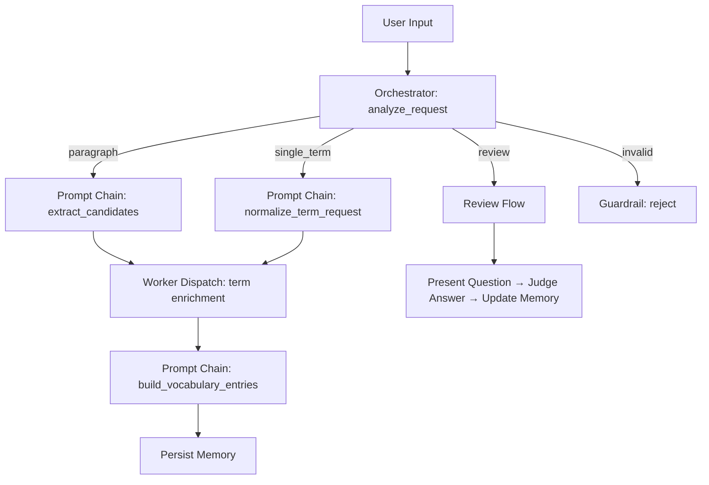

# LeXi

영어 기술 문서를 읽다가 모르는 표현이 나오면, 그 문장을 그대로 붙여넣으세요.
LeXi가 핵심 용어를 골라 한국어 뜻, 출처 문장, 맥락 설명, 학습 우선순위가 담긴 학습 카드를 만들어 줍니다.
만들어진 카드는 자동으로 단어장에 저장되고, `review`를 입력하면 저장된 단어를 복습할 수 있습니다.

## 주요 기능

### 입력 유형 자동 분기

사용자가 입력 형식을 신경 쓰지 않아도, LeXi가 아래 네 가지를 자동으로 구분합니다.

| 입력 예시 | 처리 방식 |
|-----------|-----------|
| 영어 기술 문단 | 핵심 용어 추출 → 학습 카드 생성 |
| 영어 기술 용어 | 해당 용어의 문맥 기반 학습 카드 생성 |
| `review`, `복습` | 저장된 단어장에서 복습 문제 출제 |
| 복습 답안 (한국어) | 답안 판정 → 피드백 제공 |

### 문맥 기반 학습 카드

단순 번역이 아니라, 실제 기술 문서를 읽을 때 도움이 되는 학습 카드를 생성합니다.

- 한국어 뜻 (문맥에 맞는 의미)
- 출처 문장 (원문에서 해당 용어가 쓰인 문장)
- 맥락 설명 (왜 이 의미가 맞는지)
- 학습 우선순위 (high / medium / low)

### 저장 기반 복습

SQLite에 저장된 단어장을 기반으로 복습 문제를 출제하고 답안을 판정합니다.

- 복습 횟수가 적은 단어, 이전에 틀린 단어를 우선 출제
- 규칙 기반 정답 판정 + LLM 기반 유사 답안 판정

### 사용자별 단어장

사용자 등록/로그인을 통해 사용자별 독립적인 단어장과 복습 기록을 유지합니다.

### Input Guardrail

일상 대화, 한국어 입력 등 학습과 관련 없는 입력은 자동으로 차단하고 안내 메시지를 제공합니다.

## 사용 시나리오

```text
사용자: Caching reduces latency, but inconsistent invalidation can cause stale data.

LeXi: 이 입력에서 학습 가치가 높은 표현을 정리했어요.

1. latency (latency)
- 뜻: 지연 시간
- 문장: Caching reduces latency, but inconsistent invalidation can cause stale data.
- 설명: 성능을 말할 때 응답이 늦어지는 시간을 뜻합니다.
- 왜 중요한가: 성능과 분산 시스템 문서에서 중요한 개념이다.
- 우선순위: high

2. invalidation (invalidation)
- 뜻: 무효화
- 문장: Caching reduces latency, but inconsistent invalidation can cause stale data.
- 설명: 캐시 데이터를 더 이상 유효하지 않게 처리하는 동작을 뜻합니다.
- 왜 중요한가: 캐시 일관성과 데이터 정확성을 이해할 때 중요하다.
- 우선순위: medium

사용자: review

LeXi: 복습 문제를 준비했어요.

단어: latency
문장: Caching reduces latency, but inconsistent invalidation can cause stale data.
이 문맥에서 이 단어의 한국어 뜻을 입력해 주세요.

사용자: 지연 시간

LeXi: 맞았어요.
정답은 지연 시간 입니다.
```

## 아키텍처

LeXi는 Gemini + LangGraph 기반의 Workflow Architecture를 사용합니다.
대표 패턴은 **Orchestrator-Workers**이며, **Prompt Chaining**과 **Parallelization**을 함께 활용합니다.



- **Orchestrator** — 사용자 입력을 분석하고 학습/복습/거부 경로를 결정
- **Workers** — 용어별 근거 문장 수집을 병렬로 처리
- **Prompt Chaining** — 후보 추출 → 근거 수집 → 카드 생성을 순차적으로 연결
- **Guardrail** — 규칙 기반 + LLM 기반으로 범위 외 입력을 차단

## 실행 방법

### 로컬 실행

```bash
# 의존성 설치
uv sync

# 앱 실행
uv run streamlit run challenge/14/run.py
```

### Streamlit Cloud 배포

1. GitHub 저장소를 Streamlit Cloud에 연결
2. Main file path: `challenge/14/run.py`
3. Secrets에 `GOOGLE_API_KEY` 추가:

```toml
GOOGLE_API_KEY = "your-api-key-here"
```

### 테스트

```bash
uv run python challenge/14/smoke_test.py
```

## 환경 변수

| 변수 | 필수 | 설명 |
|------|------|------|
| `GOOGLE_API_KEY` | O | Google Gemini API 키 |
| `GOOGLE_GENAI_MODEL` | X | 사용할 모델 (기본값: `gemini-3-flash-preview`) |

## 프로젝트 구조

```text
lexi_app/
  app.py          # Streamlit UI, 세션 관리, 로딩 UX
  config.py       # 환경 설정, LLM 초기화
  state.py        # TypedDict 기반 상태 정의
  schemas.py      # Pydantic 구조화 출력 모델
  tools.py        # 문장 분리, 복습 후보 선택
  memory.py       # SQLite 영속성 (사용자별 분리)
  nodes.py        # LangGraph 노드 (라우팅, 추출, 판정, guardrail)
  graph.py        # 상태 그래프 빌더
  service.py      # 오케스트레이션 레이어
```

## 기술 스택

- **LLM**: Google Gemini (`langchain-google-genai`)
- **Workflow**: LangGraph (상태 그래프, 조건부 엣지, 병렬 워커)
- **UI**: Streamlit (채팅 인터페이스, 폼 기반 로그인)
- **Storage**: SQLite (사용자별 단어장, 복습 기록)
- **Structured Output**: Pydantic 모델 기반 LLM 구조화 출력
