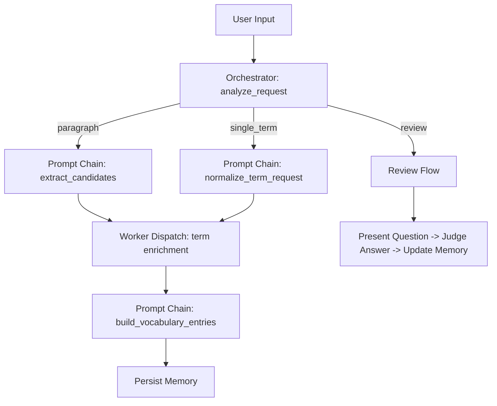

# Challenge 14

## LeXi

LeXi는 영어 기술 문서 학습 에이전트다.
`Streamlit` 기반 채팅 UI를 사용해, 학습 입력부터 단어 카드 생성과 복습까지 한 화면에서 끝까지 사용할 수 있다.

Challenge 13의 LeXi를 기반으로, UI 완성, 에러 처리, 사용자 구분, UX 개선, Streamlit Cloud 배포를 진행한 버전이다.

### 핵심 기능

- **입력 유형 자동 분기** - 문단 학습, 단일 용어 학습, 복습 요청을 구분해 다른 워크플로로 처리한다.
- **문맥 기반 단어 카드 생성** - 중요한 기술 용어를 추출하고, 한국어 뜻, 출처 문장, 맥락 설명, 학습 우선순위를 함께 정리한다.
- **저장 기반 복습** - SQLite에 저장된 단어장을 기반으로 review 문제를 내고 답안을 판정한다.
- **사용자 구분** - 사용자 등록/선택 UI를 통해 사용자별 독립적인 단어장과 복습 기록을 유지한다.

### Challenge 13 대비 변경 사항

- 복습 루프 라우팅 버그 수정 (`route_after_next_review`)
- DB 스키마 불일치 수정 (`why_it_matters`, `study_priority` 컬럼 추가)
- 사용자 등록/선택 기능 추가 (사용자별 메모리 분리)
- SQLite 에러 처리 및 LLM 연결 확인 추가
- 온보딩 메시지, 사이드바 한국어화, `st.status` 기반 로딩 상태 표시
- 채팅 기록 100개 제한
- Streamlit Cloud 배포 파일 추가

## Advanced Pattern

`LeXi`는 `Workflow Architecture`를 사용한다. 대표 패턴은 `Orchestrator-Workers`다.

- 중앙 orchestrator가 입력을 분석하고 학습 경로를 결정한다.
- term별 근거 문장 수집은 worker에게 위임한다.
- 이 과정에서 여러 LLM 호출이 순차적으로 이어지는 `Prompt Chaining`과, term별 처리 작업을 병렬로 나누는 `Parallelization`도 함께 사용한다.



## Run

### 로컬 실행

```bash
uv run streamlit run challenge/14/run.py
```

### Streamlit Cloud 배포

1. GitHub 저장소를 Streamlit Cloud에 연결한다.
2. Main file path를 `challenge/14/run.py`로 설정한다.
3. Streamlit Cloud의 Secrets에 `GOOGLE_API_KEY`를 추가한다.

```toml
GOOGLE_API_KEY = "your-api-key-here"
```

### Smoke Test

```bash
uv run python challenge/14/smoke_test.py
```

## Environment

- required: `GOOGLE_API_KEY`
- optional: `GOOGLE_GENAI_MODEL` (기본값: `gemini-3-flash-preview`)

## Project Structure

```text
challenge/14/
  README.md
  run.py
  smoke_test.py
  requirements.txt
  .streamlit/
    config.toml
    secrets.toml.example
  lexi_app/
    app.py          # Streamlit UI 및 세션 관리
    config.py       # 설정 및 LLM 초기화
    state.py        # TypedDict 상태 정의
    schemas.py      # Pydantic 구조화 출력 모델
    tools.py        # 문장 분리, 복습 후보 선택
    memory.py       # SQLite 영속성 (사용자별 분리)
    nodes.py        # LangGraph 노드 구현
    graph.py        # 그래프 빌더
    service.py      # 오케스트레이션 레이어
```
